  

# 🚀 Awesome AI Observability & LLM Evaluation Ecosystem 🤖

  
  
  
  

> **A curated collection of top SaaS products, open-source platforms, and tools for AI Observability, LLM Tracing, Prompt Monitoring, Agent Spans, Evaluation Dashboards, and Production AI Telemetry.**

---

## 📋 Table of Contents
- [🌐 SaaS / Hosted AI Observability Platforms](#-saas--hosted-ai-observability-platforms)
- [🔓 Open-Source AI Observability Projects](#-open-source-ai-observability-projects)
- [🛠️ Key Features & Use Cases](#%EF%B8%8F-key-features--use-cases)
- [🤝 How to Contribute](#-how-to-contribute)
- [💖 Support & Community](#-support--community)
- [📈 Star History](#-star-history)
- [⚠️ Disclaimer](#%EF%B8%8F-disclaimer)

---

## 📊 Market Overview & Industry Structure

> 💡 **Market Size & Structure**: The global **AI Observability & LLM Evaluation Market** is estimated at **$1.8 Billion - $2.5 Billion (2026)** and projected to expand rapidly alongside enterprise GenAI adoption. The sector is currently **moderately fragmented**, featuring a dynamic blend of specialized LLMOps startups, developer-first open-source core platforms, and major MLOps/Enterprise APM acquirers (e.g., Dynatrace acquiring Arize AI for $915M, Cisco acquiring Galileo). While consolidation is picking up among top platforms, open standards like OpenTelemetry ensure low vendor lock-in.

---

## 🌐 SaaS / Hosted AI Observability Platforms

The table below summarizes leading cloud-hosted AI observability platforms, sorted by company valuation/funding in descending order:

| 🏢 Platform | 💰 Valuation / Company Size | 🏷️ Starting Pricing Tier | 🎁 Free Tier / Trial Limit | 🎯 Key Focus & Features |
| :--- | :--- | :--- | :--- | :--- |
| **[Weights & Biases](https://wandb.ai/)** | **$1.25 Billion** (Valuation) | $50 / user / month (Team) | Free Forever (1 user, 100 GB storage, unlimited personal experiments & prompt traces) | MLOps & LLM experiment tracking, W&B Prompts, model evaluation, and multi-agent monitoring. |
| **[LangSmith](https://www.langchain.com/langsmith)** (by LangChain) | **$1.25 Billion** (Valuation) | $39 / seat / month (Plus plan; $2.50 per 1,000 base traces) | Free Developer Plan (1 seat, 5,000 base traces/month, 14-day data retention) | End-to-end tracing, prompt engineering playground, automated evals, and tight LangChain/LangGraph integration. |
| **[Arize AI](https://arize.com/)** (Arize AX) | **$915 Million** (Acquired by Dynatrace) | $0.0004 / span (Pro tier overage) | AX Free Plan (25,000 spans/month, 1 GB data ingestion, 15-day retention, unlimited users) | Enterprise AI & LLM observability, online evaluation, embedding drift detection, and troubleshooting. |
| **[Galileo](https://www.rungalileo.io/)** | **$68 Million Funding** (Acquired by Cisco/Splunk) | Custom enterprise quote (starts ~$500/mo) | 14-Day Free Trial (Full platform access with small language model Luna evals) | Hallucination detection, prompt quality scoring, Luna guardrails, and compliance dashboards. |
| **[Fiddler AI](https://www.fiddler.ai/)** | **$123 Million Funding** | $0.002 / trace (Developer tier) | Free Developer Tier (Up to 10,000 traces/month for guardrails & continuous evals) | Enterprise AI Control Plane, model governance, explainability, safety guardrails, and auditability. |
| **[Langfuse Cloud](https://langfuse.com/)** | **$29/mo - $2,499/mo** (VC Backed) | $29 / month (Core plan) | Free Hobby Plan (50,000 units/month, 2 users, 30-day data retention) | Production tracing, prompt management, user session tracking, score analytics, and dataset evals. |
| **[Helicone](https://helicone.ai/)** | **Y Combinator** (VC Backed) | $79 / month (Pro plan) | Free Hobby Plan (10,000 requests/month, 1 GB storage, 1 seat, 7-day retention) | Smart AI gateway, one-line proxy tracing, prompt caching, rate limiting, and cost tracking. |

---

## 🔓 Open-Source AI Observability Projects

Discover top open-source projects for self-hosted LLM tracing, evals, and prompt monitoring. Sorted by **GitHub Star Count** (descending):

| 📦 Repository & Link | ⭐ Star Count | 📜 License | 🔍 Highlights & Architecture |
| :--- | :--- | :--- | :--- |
| **[Langfuse](https://github.com/langfuse/langfuse)** |  | MIT | Full open-source LLM engineering platform for tracing, evals, prompt management, and analytics with self-hostable Docker stack. |
| **[Opik](https://github.com/comet-ml/opik)** (Comet) |  | Apache-2.0 | Open-source LLM evaluation, test generation, and trace monitoring toolkit for production and CI/CD pipelines. |
| **[DeepEval](https://github.com/confident-ai/deepeval)** |  | Apache-2.0 | Open-source LLM evaluation framework for unit testing prompts, RAG applications, and agent responses with custom metrics. |
| **[Evidently](https://github.com/evidentlyai/evidently)** |  | Apache-2.0 | Open-source ML and LLM observability framework providing data drift detection, quality reports, and interactive dashboards. |
| **[Arize Phoenix](https://github.com/Arize-ai/phoenix)** |  | ELv2 | Notebook-first AI observability library for tracing, evaluation, datasets, and embedding visualization. |
| **[OpenLLMetry](https://github.com/traceloop/openllmetry)** (Traceloop) |  | Apache-2.0 | OpenTelemetry-based standard instrumentation for GenAI LLM providers, vector databases, and frameworks into standard APM tools. |
| **[Helicone](https://github.com/Helicone/helicone)** |  | Apache-2.0 | Lightweight proxy-based LLM observability platform capturing latency, cost, and request/response logs without code changes. |
| **[AgentOps](https://github.com/AgentOps-AI/agentops)** |  | MIT | Specialized observability and analytics framework for multi-agent LLM systems, tool execution spans, and session replays. |
| **[TruLens](https://github.com/truera/trulens)** |  | MIT | Evaluation and tracking library for RAG systems and LLM applications using feedback functions and honesty metrics. |
| **[PromptLayer](https://github.com/MagnivOrg/prompt-layer-library)** |  | MIT | Early developer library for logging, managing, and tracking versioned OpenAI and LLM prompt requests. |

---

## 🛠️ Key Features & Use Cases

- 🔍 **Trace Spans & Multi-Agent Monitoring**: Track step-by-step reasoning, tool invocations, and API calls across complex multi-agent frameworks (LangGraph, CrewAI, AutoGen).
- 📈 **Prompt Engineering & Versioning**: Test, manage, and deploy prompt versions without changing application code.
- ⚡ **Latency & Cost Analytics**: Monitor token consumption, API rates, model breakdown, and response times in real time.
- 🧪 **Automated Evals & RAG Metrics**: Measure hallucination rate, context relevance, ground truth alignment, and custom metrics.
- 📡 **OpenTelemetry Standardisation**: Instrument LLM telemetry using vendor-neutral OTel conventions to export data straight to Datadog, Grafana, Honeycomb, or self-hosted collectors.

---

## 🤝 How to Contribute

Contributions are warmly welcome! Please follow these simple steps:

1. Fork this repository.
2. Add your entry under either [SaaS Platform](#-saas--hosted-ai-observability-platforms) or [Open-Source Projects](#-open-source-ai-observability-projects).
3. Ensure formatting matches the existing markdown tables.
4. Submit a Pull Request detailing the added solution.

---

## 💖 Support & Community

If you find this repository helpful for your AI stack or research, please consider supporting the project:

- ⭐ **Star** this repository to help others discover it!
- 🔀 **Fork** and share it with fellow AI engineers and MLOps builders.
- ☕ **Buy me a coffee**: Support ongoing open-source maintenance via the [Sponsor Dashboard](https://github.com/sponsors/ishandutta2007).

---

## 📈 Star History

---

## ⚠️ Disclaimer

- This is a community-curated list and is provided for informational and educational purposes.
- Trace logs often capture sensitive prompts and user data. Always configure data privacy, PII redacting, and data retention policies in accordance with applicable laws (GDPR, CCPA, HIPAA).
- All brand names and logos belong to their respective trademark holders.
